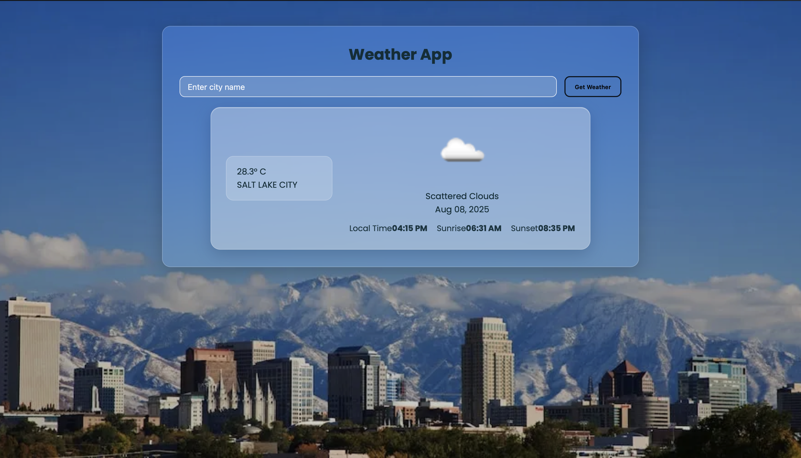

# Django Weather App

A simple Django application that shows the current weather for any city using the OpenWeather API and Google Custom Search for dynamic background images.

## Screenshots

### Main Weather UI

### Error State (City Not Found)

